# 安裝jdk(java se development kit)

- [jdk](https://www.oracle.com/tw/java/technologies/downloads/#jdk23-windows)

- 新增環境變數JAVA_HOME, 值為jdk安裝路徑

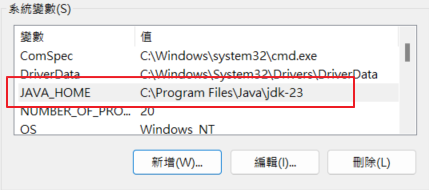

# 安裝android studio

- [android studio](https://developer.android.com/studio?hl=zh-tw)

- 安裝適合的sdk版本, 與對應版本的sdk tool(官方建議api level 28(9.0))

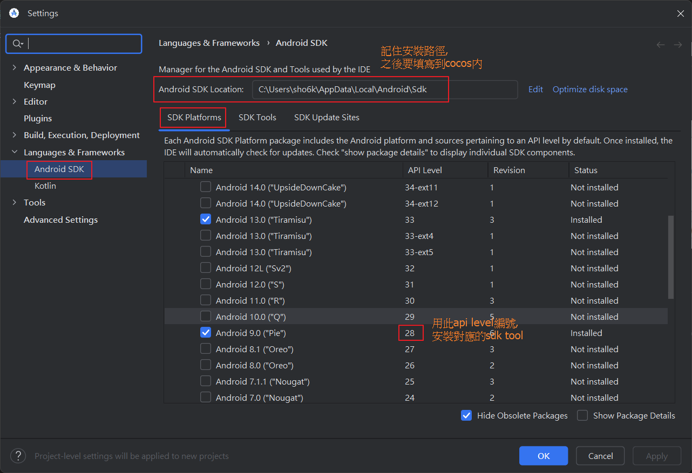

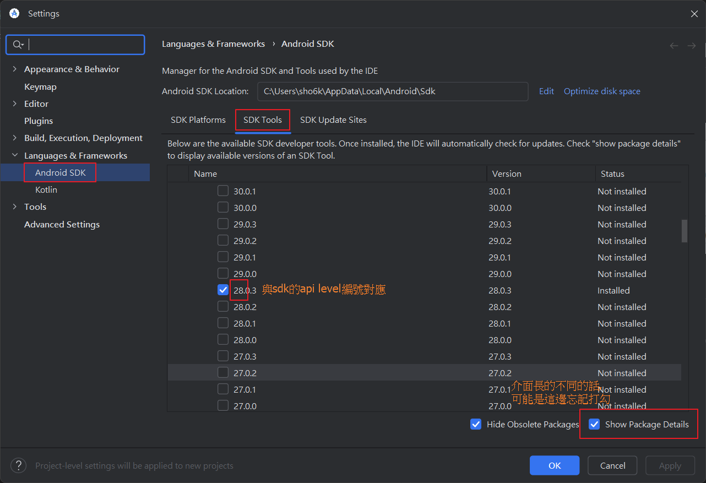

- 安裝適合的ndk版本(官方建議的r19太舊了, 測試時用到r26有成功)

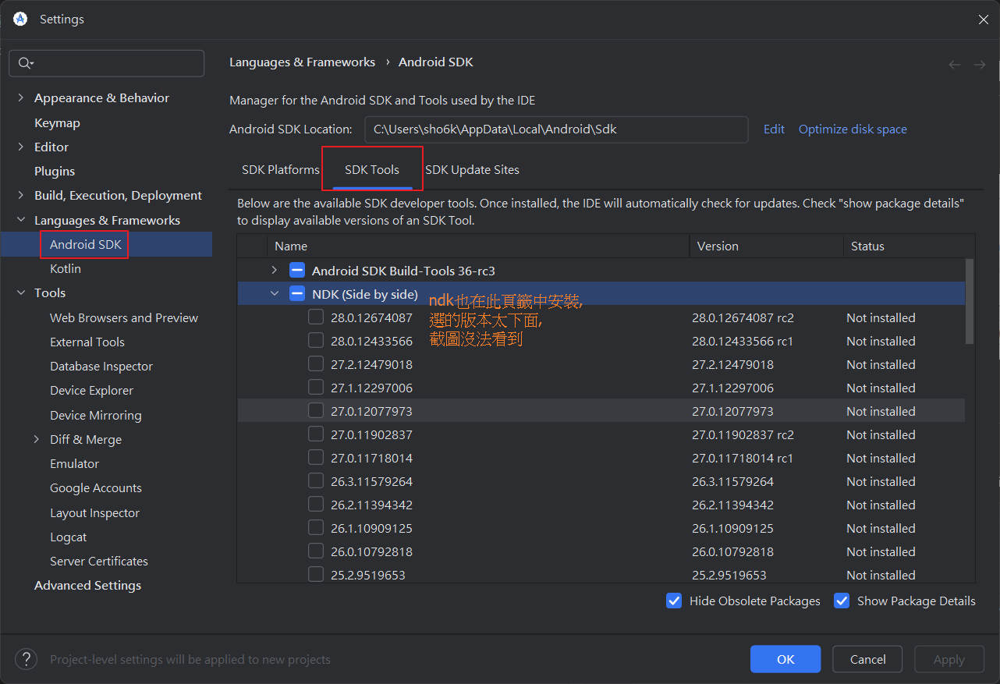

- 裝完後記得把安裝路徑記錄下來, 之後要填入cocos中

# 設置cocos與導出專案

- 將sdk與ndk路徑, 填入cocos中

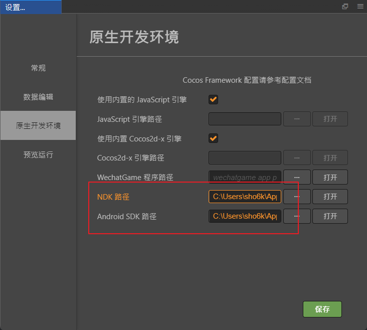

- ndk路徑需指定為使用的版本

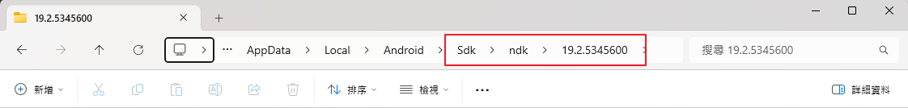

- 將發布平台選擇android, 並依需求設定完後,  
按下建構, 即可以在build資料夾內, 找到導出的專案

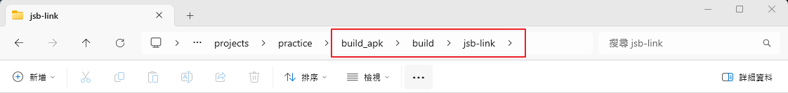

- 設定app abi的注意事項

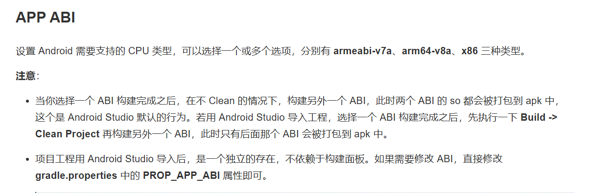

# 虛擬機

- 使用android studio打開導出的專案

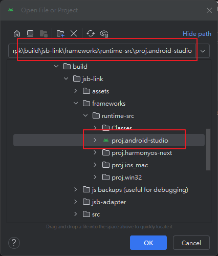

- 如果出現下圖的錯誤, 可執行升級gradle解決

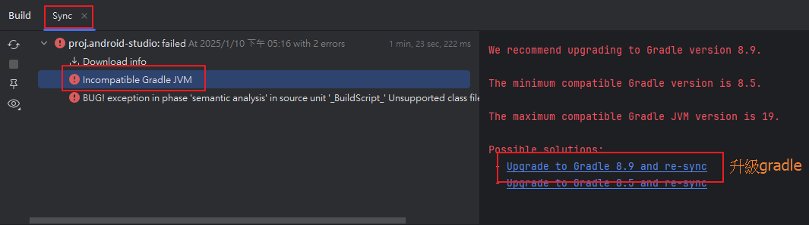

- 工具列 > tools > device manage > +(create virtual device), 新增虛擬機

- 設定虛擬機配置, 可用new hardware profile設定細部配置

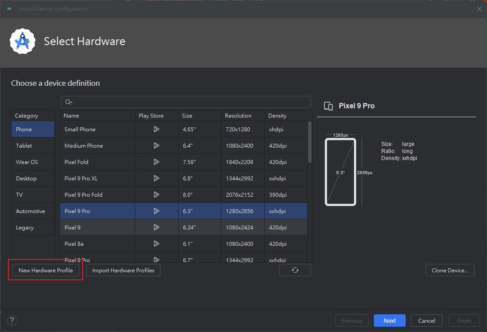

- 設定虛擬機對應的api level, 與之後的其他設定

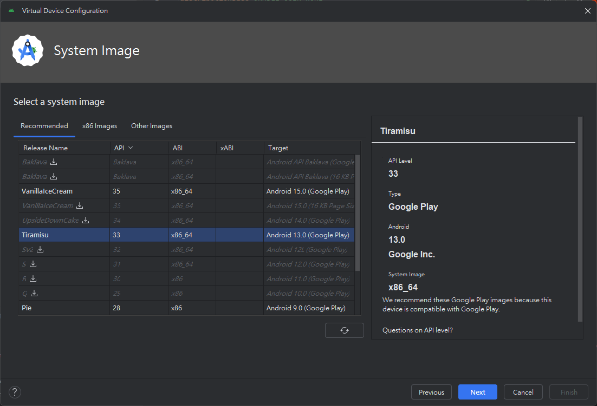

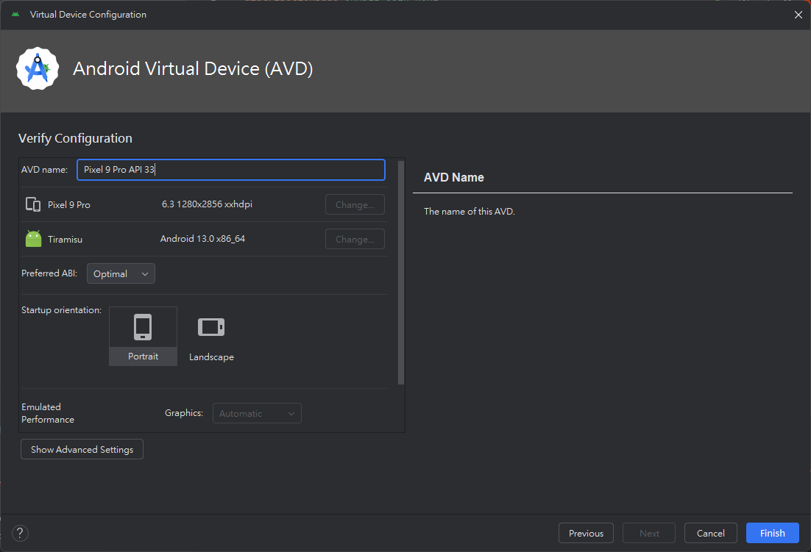

- 完成後即可看見剛才新增的虛擬機, 並使用虛擬機進行除錯

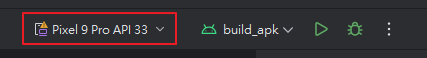

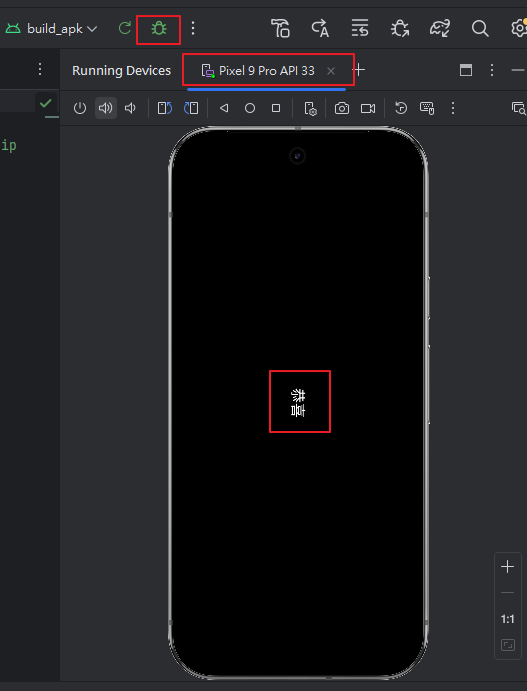

- 虛擬機不能運行的話, 換成比較高的api level, 或是不同abi試試看

- 虛擬機運行失敗的話, 還是可以試著做apk產出

# 產出apk

- 工具列 > build > generate singed app bundle / apk, 開始準備生成apk

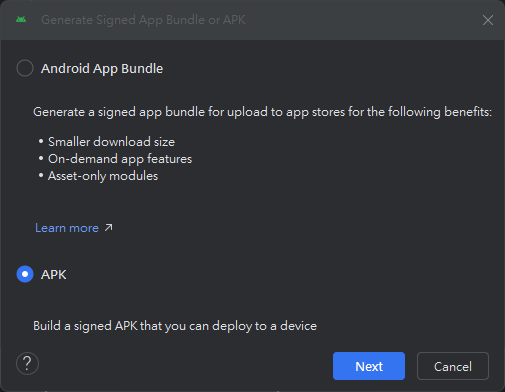

- 設定key store, 或是生成一個新的key store使用

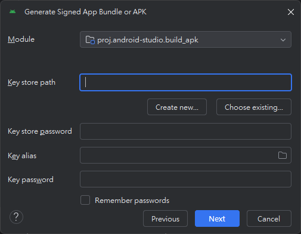

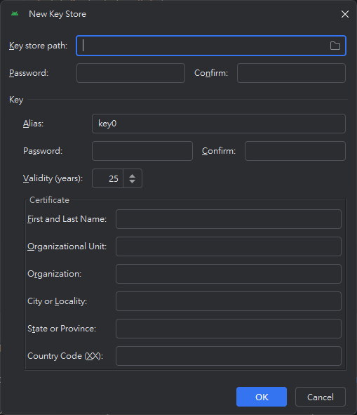

- 選擇產出的版本後, 即可在指定路徑看到產出的apk

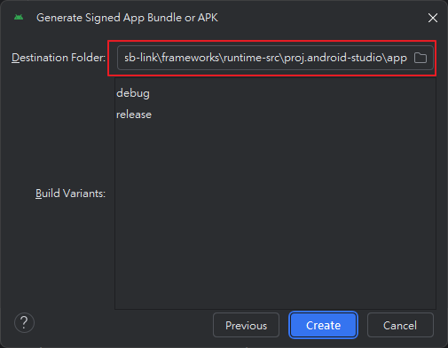

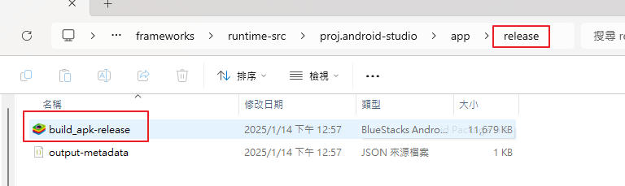

- 試裝在模擬器上

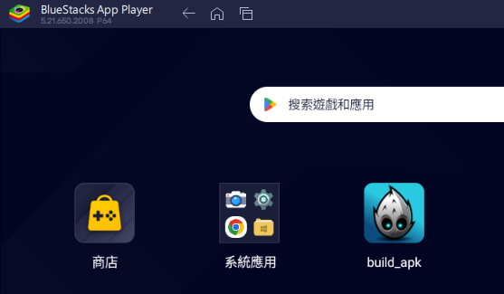

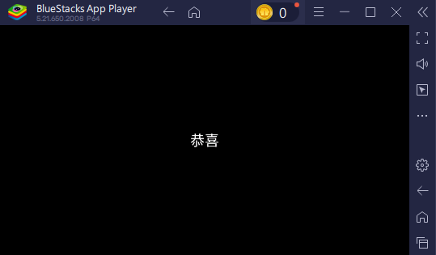

- 打完收工

# 參考連結

- [安裝配置原生開發環境](https://docs.cocos.com/creator/2.4/manual/zh/publish/setup-native-development.html)

- [打包發布原生平台](https://docs.cocos.com/creator/2.3/manual/zh/publish/publish-native.html)