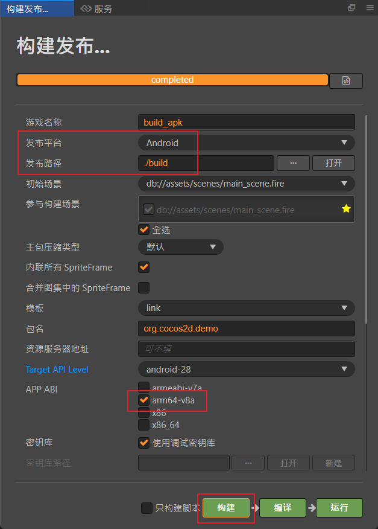

# 安裝jdk(java se development kit)

- [jdk](https://www.oracle.com/tw/java/technologies/downloads/#jdk23-windows)

- 新增環境變數JAVA_HOME, 值為jdk安裝路徑

# 安裝android studio

- [android studio](https://developer.android.com/studio?hl=zh-tw)

- 安裝適合的sdk版本, 與對應版本的sdk tool(官方建議api level 28(9.0))

- 安裝適合的ndk版本(官方建議r19)

- 裝完後記得把安裝路徑記錄下來, 之後要填入cocos中

# 設置cocos與導出專案

- 將sdk與ndk路徑, 填入cocos中

- **特別注意ndk的正確路徑需指定為使用的版本**

- 將發布平台選擇android, 並依需求設定完後,  
按下建構, 即可以在build資料夾內, 找到導出的專案

- **`設定app abi的注意事項`**

# 參考連結

- [安裝配置原生開發環境](https://docs.cocos.com/creator/2.4/manual/zh/publish/setup-native-development.html)

- [打包發布原生平台](https://docs.cocos.com/creator/2.3/manual/zh/publish/publish-native.html)